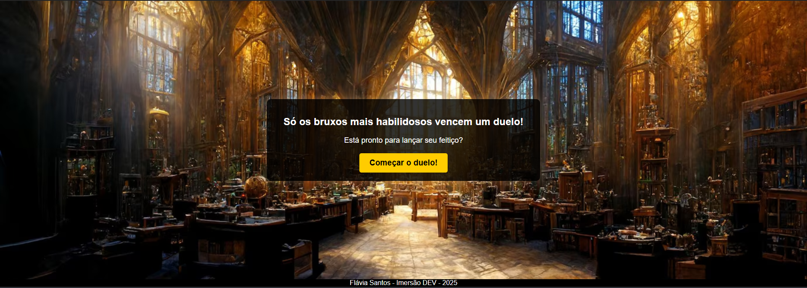

# Duelo de feitiços

Desenvolvi este projeto durante a Imersão Dev 9ª Edição da Alura, transformando o clássico jogo Pedra, Papel e Tesoura em um duelo de feitiços inspirado no universo de Harry Potter.

## ✨ Funcionalidades

- Escolha entre três feitiços para desafiar o computador.
- O jogo utiliza Math.random() para gerar uma escolha aleatória para o oponente.
- A mecânica segue o estilo Pedra, Papel e Tesoura, determinando o vencedor com condicionais (if/else).
- Exibição do resultado do duelo com mensagens dinâmicas e interativas.

## 👨‍💻 Tecnologias Utilizadas

- HTML5
- CSS3
- JavaScript

## 🛠 Visualize o projeto:

[Clique aqui para acessar o jogo](https://codepen.io/Flaviasants/pen/PwoXKqz).

Feito com ❤️ por [Flávia Santos](https://github.com/Flaviasants).